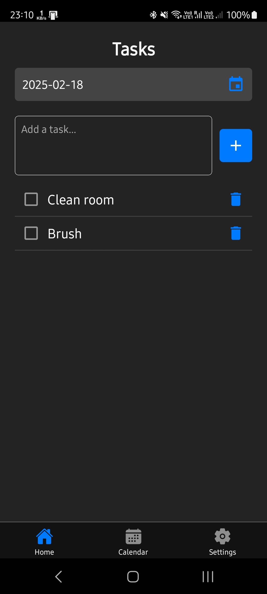
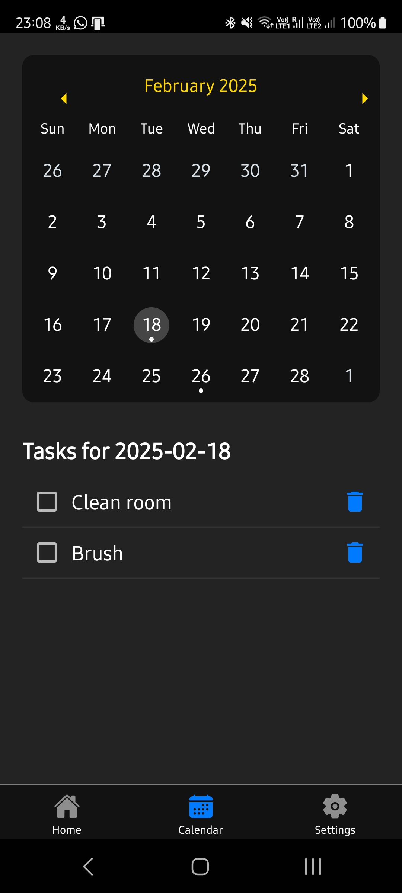
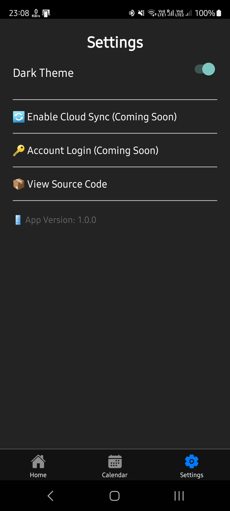

# To-Do App

A simple and efficient To-Do application built with React Native. The app helps you manage your daily tasks with features like dark mode, calendar integration, and an intuitive UI.

## Features
- **Task Management**: Add, remove, and mark tasks as completed.
- **Dark Mode Support**: Automatically adjusts based on the system theme.
- **Calendar Integration**: View tasks organized by date and manage them within the calendar.
- **Minimalist UI**: Designed for simplicity and ease of use.
- **App Version Info**: Displays app version in the settings screen.
- **Upcoming Features**: Cloud sync and account login (coming soon).

## Screenshots

### 📝 Home Screen

  

### 📅 Calendar Screen

  

### 📅 Settings Screen

  

## Download APK
[Click here to download the APK](https://drive.google.com/file/d/1yYr--7CYySODZlKimmfSEw3mzWAEPTka/view?usp=sharing)

## Credits
- **Icons**: [Material Community Icons](https://materialdesignicons.com/)
- **AppIcon**: [Duty icons created by Ghozi Muhtarom - Flaticon](https://www.flaticon.com/)

